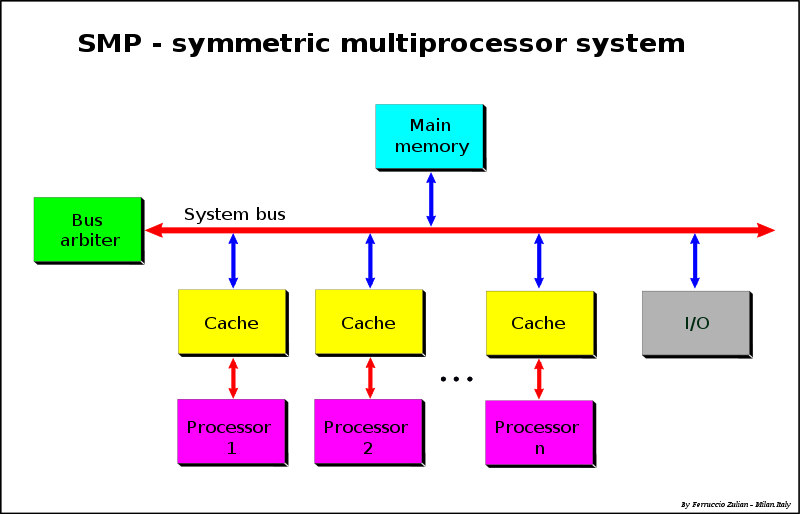
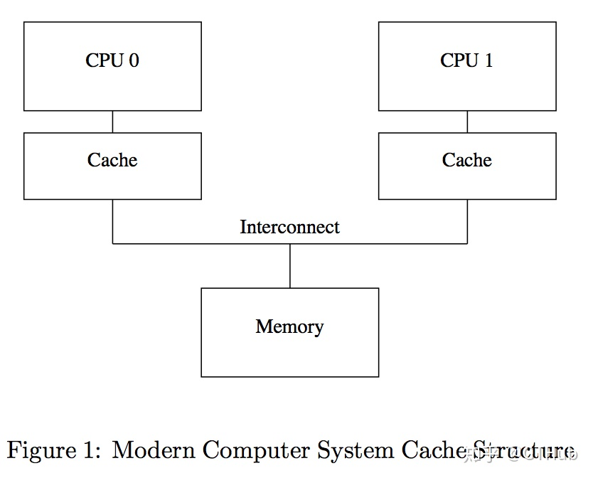
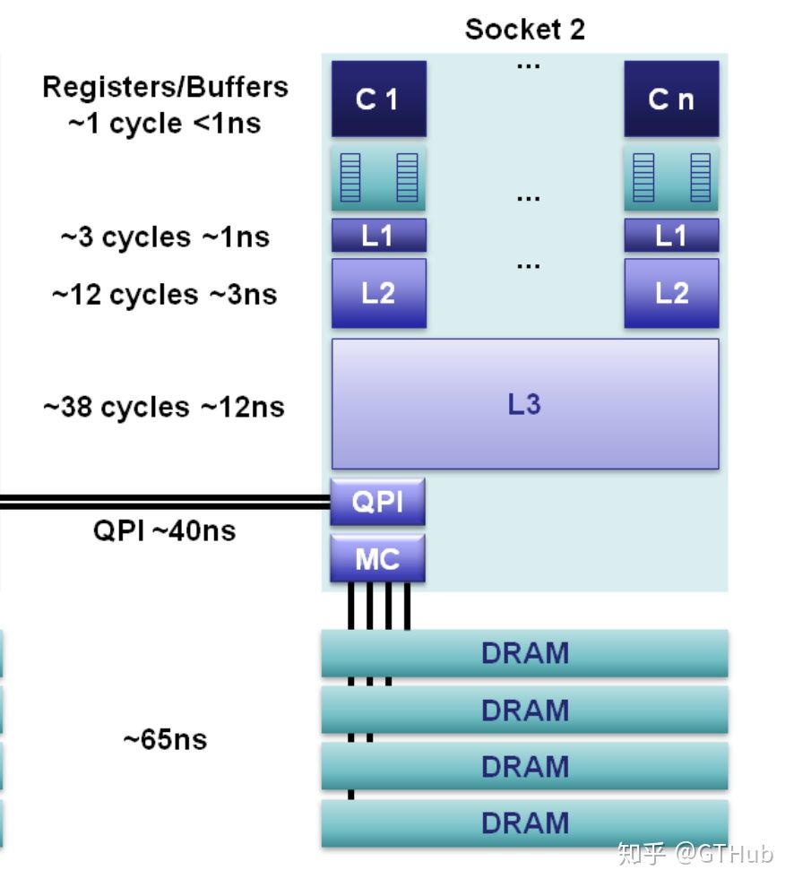

# CPU cache memory

1、cache对programmer是透明的

2、但是，在进入了non-blocking、high performance领域后，发现很多technique都涉及cache，因此，我决定对这个topic进行总结

3、cache是memory中的重要组成部分，对CPU性能的影响极大

## Architecture

建立其architecture对于理解相关问题是非常重要的，在下面文章中，有着非常好的描述:

1、wikipedia [Symmetric multiprocessing](https://en.wikipedia.org/wiki/Symmetric_multiprocessing)

2、zhuanlan.zhihu [高并发编程--多处理器编程中的一致性问题(上)](https://zhuanlan.zhihu.com/p/48157076)

