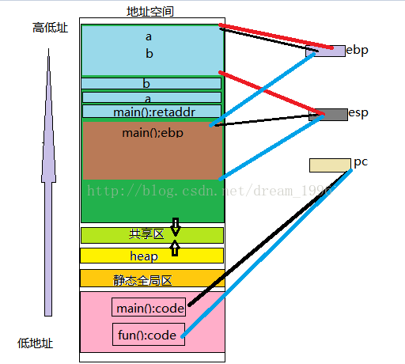

# 浅谈栈帧

## 什么是栈帧？

什么是**栈帧**，首先引用百度百科的经典解释：**栈帧**也叫**过程活动记录**，是编译器用来实现过程/函数调用的一种**数据结构**。

实际上，可以简单理解为：**栈帧**就是存储在**用户栈**上的（当然**内核栈**同样适用）每一次**函数调用**涉及的相关信息的**记录单元**。也许这样感觉更复杂了，好吧，让我们从**栈**开始来理解什么是**栈帧**...

**栈帧**表示程序的函数调用记录，而**栈帧**又是记录在**栈**上面，很明显栈上保持了N个栈帧的实体，那就可以说**栈帧**将栈分割成了N个记录块，但是这些记录块大小不是固定的，因为**栈帧**不仅保存诸如：函数入参、出参、返回地址和上一个栈帧的**栈底指针**等信息，还保存了函数内部的**自动变量**（甚至可以是动态分配内存，alloca函数就可以实现，但在某些系统中不行），因此，不是所有的栈帧的大小都相同。

> 是不是每一个函数调用就对应一个栈帧？

## 理解

我们拿一个实例来探讨一下

这是一个在linux下运行的程序，当程序走到`*p=fun`时会调用`fun`函数，最后执行`reboot`指令关机重启。这是为什么呢？我们就拿栈帧来看一下。

首先了解栈帧的基本结构。

**栈帧**其实是两个**指针寄存器**，**寄存器ebp**为**帧指针**，而**寄存器esp**为**栈指针**，当程序运行时，**栈指针**可以移动(大多数的信息的访问都是通过**帧指针**的)。总之简单一句话，栈帧的主要作用是用来控制和保存一个过程的所有信息的。

再来看一下我们当前程序的栈帧

因为fun1中*p=&a;即p中保存的a的地址，p指向a,  p--;会向下走，p指向了调用fun1函数的返回地址，然后再将fun的地址给了P,这时候p就不能正常返回了，而是当p要返回时却调用了fun函数，这时候就会执行reboot指令。

你听懂了吗

# [函数栈帧图解](https://blog.csdn.net/stay_the_course/article/details/53044575)

我们知道内存空间大致可以用下图表示： 
 

首先应该明白，栈是从高地址向低地址延伸的。每个函数的每次调用，都有它自己独立的一个栈帧，这个栈帧中维持着所需要的各种信息。

寄存器ebp指向当前的栈帧的底部（高地址）

寄存器esp指向当前的栈帧的顶部（地址地）

PC指针：永远指向当前运行程序指令的下一条指令

而函数在调用的时候都是在**栈空间**上开辟一段空间以供函数使用，所以下面来详细谈一谈函数的**栈帧结构**。 
如图示，栈是由**高地址**向**低地址**的方向生长的，而且栈有其**栈顶**和**栈底**，在`x86`系统的CPU中，寄存器`ebp`保存的是**栈底地址**，称为**帧指针**，寄存器`esp`保存的是**栈顶地址**，称为**栈指针**。而且还应该明确一点，**栈指针**和**帧指针**一次只能存储一个地址，所以，任何时候，这一对指针指向的是**同一个函数**的**栈帧结构**。并且`ebp`一般由系统改变它的值，而`esp`会随着数据的**入栈**和**出栈**而移动，也就是说**esp**始终指向栈顶。在明白了这些之后，下面我们来看一个具体的例子： 
` 
就像前面说的，函数在执行的时候，是在栈上开辟空间，也就是第一幅图的绿色部分，而且我们知道，程序是逐句执行的，变量是逐个被定义和分配内存空间的，这也是**栈指针**是移动的的原因，下面我们逐句执行这段代码（VS2015环境下），来看**main函数**和**fun函数**的栈帧结构的变化（注：为方便理解，下面的图都是可以按顺序直接拼接的）： 

在这里我们可以看到变量的定义分配内存顺序便是先定义先分配，结合**汇编语言**我们可以看得更清楚： 
 
然后，程序继续执行进入fun函数，这里我们来看汇编语言： 
 
 
这里我们主要要明白两点，（1）call指令的两个功能，（2）上图中红色的圈1，圈2的目的。call指令的功能上图描述的很清楚，这里不再赘述，圈1目的是将`main`函数的`pc`压入堆栈，因为`pc`指针里面放的始终是下一条要执行指令的地址，这里把`pc`压入堆栈进行保护，是因为在执行fun函数的时候`pc`指针里面放的将会是fun函数需要执行里面的内容，同样的道理，我们知道**某一时刻只能有一个栈帧结构**，当要去到fun函数的时候，寄存器`ebp`就要存储`fun`函数的帧指针，所以`main`函数的**帧指针**就要保存起来，查看`main`函数的汇编语言也可以清楚的看到这一点： 
 
然后进入到fun函数：

总结一下就是这样： 
 
在`fun`函数执行完成之后，会返回到`main`函数，这里要做的就是**出栈**，也就是就在形成`fun`函数之前压入堆栈进行保护的`pc`指针，main函数的`ebp`弹出堆栈，重新形成或者说还原`main`函数的栈帧结构。

# [栈帧---函数调用原理](https://blog.csdn.net/dream_1996/article/details/53845441)

**一、 什么是栈帧？**

​    什么是栈帧，首先引用百度百科的经典解释：“栈帧也叫过程[活动记录](http://baike.baidu.com/view/2196586.htm)，是[编译器](http://baike.baidu.com/view/487018.htm)用来实现过程/[函数调用](http://baike.baidu.com/view/2369016.htm)的一种[数据结构](http://baike.baidu.com/view/9900.htm)。”。

​    实际上，可以简单理解为：栈帧就是存储在用户栈上的（当然内核栈同样适用）每一次函数调用涉及的相关信息的记录单元。也许这样感觉更复杂了，好吧，让我们从栈开始来理解什么是栈帧...

**二、栈帧**

​    栈帧表示程序的函数调用记录，而栈帧又是记录在栈上面，很明显栈上保持了N个栈帧的实体，（实际上我们这里说的栈帧是软件上的概念，据说有硬件概念，不是很了解），那就可以说栈帧将栈分割成了N个记录块，但是这些记录块大小不是固定的，因为栈帧不仅保存诸如：函数入参、出参、返回地址和上一个栈帧的栈底指针等信息，还保存了函数内部的自动变量（甚至可以是动态分配内存，alloca函数就可以实现，但在某些系统中不行），因此，不是所有的栈帧的大小都相同。

**三、下面我通过一个简单的实例来分析函数调用原理------栈帧**

首先应该明白，栈是从高地址向低地址延伸的。每个函数的每次调用，都有它自己独立的一个栈帧，这个栈帧中维持着所需要的各种信息。

寄存器ebp指向当前的栈帧的底部（高地址）

寄存器esp指向当前的栈帧的顶部（地址地）

PC指针：永远指向当前运行程序指令的下一条指令

下图为典型的存取器安排，观察栈在其中的位置

**见上图，————黑色线指向的是调用者函数main()**

​               **————蓝色线指向的是被调用者函数fun()**

​               **————红色线指向的的是函数fun()返回时，恢复到调用函数fun()之前的状态**

> 这张图非常重要，它将进程的地址空间，进程运行时刻的状况展现出来了，是一个综合性地内容。

根据这简单的代码，然后在观察上面的栈帧图，我们来看函数调用过程的栈帧原理

**[html]** [view plain](https://blog.csdn.net/dream_1996/article/details/53845441#) [copy](https://blog.csdn.net/dream_1996/article/details/53845441#)

1. \#include<stdio.h>  
2. \#include<windows.h>  
3.   ​
4. int fun(int x, int y)  
5. {  
6. ​    int c = 0xcccccccc;  
7. ​    return c;  
8. }  
9. int main()  
10. {  
11. ​    int a = 0xaaaaaaaa;  
12. ​    int b = 0xbbbbbbbb;  
13. ​    int ret = fun(a, b);  
14. ​    printf("You should runing here!\n");  
15. ​    system("pause");  
16. ​    return 0;  
17. }  

**我们可以通过观察上面这个代码和栈帧图还有下面反汇编的代码发现**

**函数调用过程如下：**

（1）先将调用者main()函数的堆栈的基址（ebp）入栈，以保存之前任务的信息。

（2）然后将调用者main()函数的栈顶指针（esp）的值赋给ebp，作为新的基址（即被调用者函数fun()的栈底）。

（3）然后在这个基址（fun()函数的栈底）上开辟（一般用sub命令）相应的空间用作被调用者fun()函数的栈空间。

（4）函数fun()返回后，从当前栈帧的ebp即恢复为调用者函数main()的栈顶（esp），使栈顶恢复函数fun()被调用钱的位置，然后调用者main()再从恢复后的栈顶弹出之前的ebp值(可以这么做是因为这个值在函数调用前前一步被压入栈”main()：retaddr”)。这样，ebp和esp就都恢复了调用函数fun（）之前的位置，也就是栈恢复函数fun()调用前的状态。

下面是一个反汇编的代码，我们知道任何函数都只有一份ebp和esp，可以通过内存窗口发现ebp和esp永远保存最新当前函数的数值，用函数时，原函数的ebp和esp要保存起来，以便返回时恢复。还可以发现a和b，是b先实例化，再是a实例化，形参实例化是从右往左。

**call命令的作用**：1.保存当前正在运行时指令的下一条指令的地址到栈结构中

​                          2.跳转到指定的函数入口（jmp）

