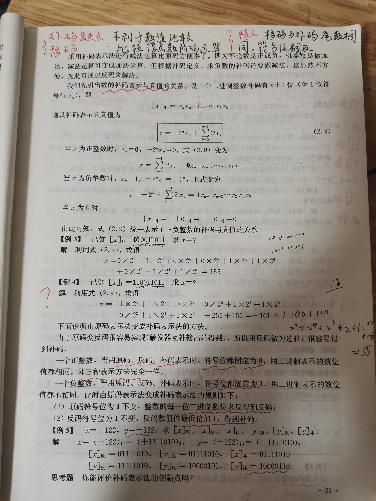

## 总结

不要死记上面的公式，而是要从原理来进行推导、记忆。

1、互补的两个数，它们的绝对值之和等于模、两者的符合相反(方向相反)

2、在计算机中，对于signed number中的负数，往往取其补码，显然此时它的补码是一个正数。

3、对于一个N(最高位为**符号位**)位的signed number，它用"N-1位"来表示数值；它只有0，没有+0和-0；后面所讨论的公式，都是对"N-1位"来进行操作

4、它的**模**是: $2^{N-1}$

下面是一些问题，这些问题主要涉及上述公式: 

一、为什么是取反加一？

1、不需要考虑符号位

2、两者的绝对值相加需要等于**模**，因此，直观地求解补码的运算为: "base - 原码绝对值"。

但是显然，其中涉及了减法；"取反加1"是对"base - 原码绝对值"的简化运算，它不涉及减法。简单记法就是: 

反码 + 原码 = `111***1`(N-1位)，然后 `+1` 则触发进位，则和为 **模**。

二、如何根据补码得到真值？

在 `Book-计算机组成原理-科学出版社-2-运算方法与运算器` 中给出了公式。

简单的记法: base - 补码绝对值。

