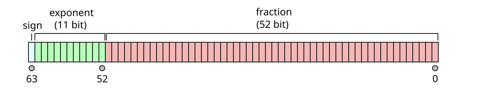
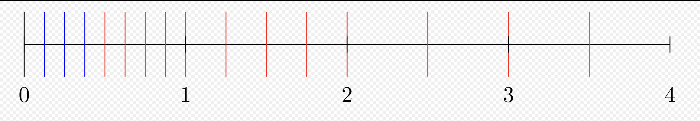

# Floating point number

在 `Book-计算机组成原理-科学出版社-2-运算方法与运算器` 中，对floating point number进行了非常简单介绍，可以作为入门读物，其中回答了如下问题:

- 为什么叫浮点数
  - zhihu [为什么叫浮点数?](https://www.zhihu.com/question/19848808) 
- .......

## 参考内容

- cnblogs [从如何判断浮点数是否等于0说起——浮点数的机器级表示](https://www.cnblogs.com/kubixuesheng/p/4107309.html) 

- paper-What-Every-Computer-Scientist-Should-Know-About-Floating-Point-Arithmetic-by-David-Goldberg

- wikipedia

### wikipedia

|                                                                                                                          | 主要内容   |     |
| ------------------------------------------------------------------------------------------------------------------------ | ------ | --- |
| wikipedia [Double-precision floating-point format](https://en.wikipedia.org/wiki/Double-precision_floating-point_format) | 双精度浮点数 |     |
| wikipedia [Single-precision floating-point format](https://en.wikipedia.org/wiki/Single-precision_floating-point_format) | 单精度浮点数 |     |
| wikipedia [Floating-point arithmetic](https://en.wikipedia.org/wiki/Floating-point_arithmetic)                           |        |     |
| wikipedia [IEEE 754](https://en.wikipedia.org/wiki/IEEE_754)                                                             |        |     |

wikipedia [Kahan summation algorithm](https://en.wikipedia.org/wiki/Kahan_summation_algorithm) 

## 双精度浮点数

### wikipedia [Double-precision floating-point format](https://en.wikipedia.org/wiki/Double-precision_floating-point_format) (双精度浮点数存储格式)

**Double-precision floating-point format** (sometimes called **FP64** or **float64**) is a [floating-point](https://en.wikipedia.org/wiki/Floating-point_arithmetic "Floating-point arithmetic") [number format](https://en.wikipedia.org/wiki/Computer_number_format "Computer number format"), usually occupying 64 [bits](https://en.wikipedia.org/wiki/Bit "Bit") in computer memory; it represents a wide range of numeric values by using a floating [radix point](https://en.wikipedia.org/wiki/Radix_point "Radix point").

Double precision may be chosen when the range or precision of [single precision](https://en.wikipedia.org/wiki/Single-precision_floating-point_format "Single-precision floating-point format") would be insufficient.

> NOTE: 双精度浮点数的范围过大、精度更高

#### IEEE 754 double-precision binary floating-point format: binary64

Double-precision binary floating-point is a commonly used format on PCs, due to its wider range over single-precision floating point, in spite of its performance and bandwidth cost. It is commonly known simply as *double*. The IEEE 754 standard specifies a **binary64** as having:

- [Sign bit](https://en.wikipedia.org/wiki/Sign_bit "Sign bit"): 1 bit
- [Exponent](https://en.wikipedia.org/wiki/Exponent "Exponent"): 11 bits
- [Significand](https://en.wikipedia.org/wiki/Significand "Significand") [precision](https://en.wikipedia.org/wiki/Precision_(arithmetic) "Precision (arithmetic)"): 53 bits (52 explicitly stored)
  - 关于此，可以参见 `Book-计算机组成原理-科学出版社-2-运算方法与运算器`

The sign bit determines the sign of the number (including when this number is zero, which is [signed](https://en.wikipedia.org/wiki/Signed_zero "Signed zero")).

The exponent field is an 11-bit unsigned integer from 0 to 2047, in [biased form](https://en.wikipedia.org/wiki/Exponent_bias "Exponent bias"): an exponent value of 1023(10位全是1) represents the actual zero. Exponents range from −1022 to +1023 because exponents of −1023 (all 0s) and +1024 (all 1s) are reserved for special numbers.

> NOTE: 
> 
> 将11-bit unsigned integer能够表示的两个最小的数用来标志special number:
> 
> | Special number | 实际编码   | 原码值  | 转换后的值         |
> | -------------- | ------ | ---- | ------------- |
> | NaN            | all 0s | 0    | 0-1023(偏移值)   |
> | Infinity       | all 1s | 2047 | 20471023(偏移值) |
> 
> 后面的Exponent encoding会对它进行详细说明 

The 53-bit significand precision gives from 15 to 17 [significant decimal digits](https://en.wikipedia.org/wiki/Significant_figures "Significant figures") precision ($2^{-53} \approx 1.11 \times 10^{-16}$). If a decimal string with at most 15 significant digits is converted to the IEEE 754 double-precision format, giving a normal number, and then converted back to a decimal string with the same number of digits, the final result should match the original string. If an IEEE 754 double-precision number is converted to a decimal string with at least 17 significant digits, and then converted back to double-precision representation, the final result must match the original number.[[1]](https://en.wikipedia.org/wiki/Double-precision_floating-point_format#cite_note-whyieee-1) 

> NOTE: 后面有对它的补充说明

The format is written with the [significand](https://en.wikipedia.org/wiki/Significand) having an implicit integer bit of value 1 (except for special data, see the exponent encoding below). With the 52 bits of the fraction (F) significand appearing in the memory format, the total precision is therefore 53 bits (approximately 16 decimal digits, $53 \log_{10}(2) \approx 15.955$). The bits are laid out as follows:



The real value assumed by a given 64–bit double–precision datum with a given [biased exponent](https://en.wikipedia.org/wiki/Exponent_bias) $E$ and a 52–bit fraction is

$$
(-1)^{\text{sign}} (1.b_{51}b_{50}\ldots b_0)_2 \times 2^{E-1023}

$$

or

$$
(-1)^{\text{sign}} \left( 1 + \sum_{i=1}^{52} b_{52-i} 2^{-i} \right) \times 2^{E-1023}

$$

##### Changing spacing/variable gap

Between $2^{52}{=}4{,}503{,}599{,}627{,}370{,}496$ and $2^{53}{=}9{,}007{,}199{,}254{,}740{,}992$ the representable numbers are exactly the integers. For the next range, from $2^{53}$ to $2^{54}$, everything is multiplied by 2, so the representable numbers are the even ones, etc. Conversely, for the previous range from $2^{51}$ to $2^{52}$, the spacing is 0.5, etc.

> NOTE: 后面会对这段话的内容进行补充说明，同时原文的"Precision limitations on integer values"段也是对此的说明

The spacing as a fraction of the numbers in the range from $2^n$ to $2^{n+1}$ is $2^{n-52}$. The maximum relative rounding error when rounding a number to the nearest representable one (the [machine epsilon](https://en.wikipedia.org/wiki/Machine_epsilon)) is therefore $2^{-53}$.

##### 表示范围总结

The 11 bit width of the exponent allows the representation of numbers between $10^{-308}$ and $10^{308}$, with full 15–17 decimal digits precision. By compromising precision, the subnormal representation allows even smaller values up to about $5 \times 10^{-324}$.

> NOTE: 后面会对这段话的内容进行详细说明

##### Exponent encoding(指数编码)

> NOTE: exponent共11位，下面按照**最高位**来对exponent进行分组:
> 
> |         | 最高位为0        | 最高位为1        |
> | ------- | ------------ | ------------ |
> | **最小值** | 0-0000000000 | 1-0000000000 |
> | **最大值** | 0-1111111111 | 1-1111111111 |

The double-precision binary floating-point exponent is encoded using an [offset-binary](https://en.wikipedia.org/wiki/Offset-binary "Offset-binary") representation, with the zero offset being 1023; also known as exponent bias in the IEEE 754 standard. Examples of such representations would be:

- $ e = \boxed{00000000001}_2 = \boxed{001}_{16} = 1 $: $ 2^{1-1023} = 2^{-1022} $ (smallest exponent for [normal numbers](https://en.wikipedia.org/wiki/Normal_number))

- $ e = \boxed{01111111111}_2 = \boxed{3ff}_{16} = 1023 $: $ 2^{1023-1023} = 2^0 $ (zero offset)

- $ e = \boxed{10000000101}_2 = \boxed{405}_{16} = 1029 $: $ 2^{1029-1023} = 2^6 $

- $ e = \boxed{11111111110}_2 = \boxed{7fe}_{16} = 2046 $: $ 2^{2046-1023} = 2^{1023} $ (highest exponent)

The exponents $\boxed{000}_{16}$ and $\boxed{7ff}_{16}$ have a special meaning:

- $\boxed{00000000000}_2 = \boxed{000}_{16}$ is used to represent a [signed zero](https://en.wikipedia.org/wiki/Signed_zero) (if $ F = 0 $) and [subnormal numbers](https://en.wikipedia.org/wiki/Subnormal_number) (if $ F \neq 0 $); and

- $\boxed{11111111111}_2 = \boxed{7ff}_{16}$ is used to represent $\infty$ (if $ F = 0 $) and [NaNs](https://en.wikipedia.org/wiki/NaN) (if $ F \neq 0 $),

where $ F $ is the fractional part of the [significand](https://en.wikipedia.org/wiki/Significand). All bit patterns are valid encoding.

Except for the above exceptions, the entire double–precision number is described by:

$$
(-1)^{\text{sign}} \times 2^{e-1023} \times 1.\text{fraction}

$$

In the case of [subnormal numbers](https://en.wikipedia.org/wiki/Subnormal_number) ($ e = 0 $) the double–precision number is described by:

$$
(-1)^{\text{sign}} \times 2^{1-1023} \times 0.\text{fraction} = (-1)^{\text{sign}} \times 2^{-1022} \times 0.\text{fraction}

$$

##### Precision limitations on integer values

* Integers from $-2^{53}$ to $2^{53}$ (–9,007,199,254,740,992 to 9,007,199,254,740,992) can be exactly represented.
* Integers between $2^{53}$ and $2^{54} = 18,014,398,509,481,984$ round to a multiple of 2 (even number).
* Integers between $2^{54}$ and $2^{55} = 36,028,797,018,963,968$ round to a multiple of 4.
* Integers between $2^n$ and $2^{n+1}$ round to a multiple of $2^{n-52}$.

### 补充说明: please explain $53 \log_{10}(2) \approx 15.955$

Of course. Let's break down the formula $53 \log_{10}(2) \approx 15.955$ step-by-step.

This formula is the mathematical bridge that connects the world of **binary precision** (how computers store numbers) to the world of **decimal precision** (how humans read numbers).

#### The Goal: Comparing Two Number Systems

The fundamental question is: "If I have a number with 53 binary digits (bits) of precision, how many decimal digits of precision is that equivalent to?"

* **Binary Precision:** With **53 bits**, you can represent $2^{53}$ unique values.

* **Decimal Precision:** With **D decimal digits**, you can represent $10^D$ unique values.

To find the equivalent decimal precision `D` for 53 bits, we need to find the value of `D` that makes the number of representable values roughly equal.

So, we set up the equation:

$$
10^D = 2^{53}

$$

This equation says: "The number of values you can make with `D` decimal digits is equal to the number of values you can make with 53 binary digits." Our goal is to solve for `D`.

#### The Tool: Logarithms

Whenever the variable you want to solve for is in an exponent (like `D` in $10^D$), you need to use **logarithms** to get it down.

We can take the logarithm of both sides of the equation. Since we want to find the number of *decimal* (base-10) digits, it's most convenient to use the base-10 logarithm, written as $\log_{10}$.

Applying $\log_{10}$ to both sides:

$$
\log_{10}(10^D) = \log_{10}(2^{53})

$$

#### The Logarithm Power Rule

Now, we use a key property of logarithms: $\log(x^y) = y \cdot \log(x)$. This rule lets us move the exponent down in front as a multiplier.

Applying this rule to both sides of our equation:

* On the left side: $\log_{10}(10^D)$ becomes $D \cdot \log_{10}(10)$

* On the right side: $\log_{10}(2^{53})$ becomes $53 \cdot \log_{10}(2)$

So our equation is now:

$$
D \cdot \log_{10}(10) = 53 \cdot \log_{10}(2)

$$

#### Simplifying and Solving

The final step is simple. The value of $\log_{10}(10)$ is just **1** (because "what power do you raise 10 to to get 10?" is 1).

So, the equation simplifies to:

$$
D \cdot 1 = 53 \cdot \log_{10}(2)

$$

$$
D = 53 \cdot \log_{10}(2)

$$

This is the exact formula from the text!

#### The Final Calculation

Now we just plug in the value for $\log_{10}(2)$:

* $\log_{10}(2) \approx 0.30103$

So,

$$
D \approx 53 \times 0.30103 \approx 15.95459...

$$

The text rounds this to **15.955**.

#### What Does 15.955 Mean?

This number is the crucial result. It tells us that a 53-bit binary number can hold **almost, but not quite, 16 full decimal digits of precision**.

* It's more than 15, which is why you can safely convert any 15-digit decimal number to a double and back without losing information.

* It's less than 16, which is why you can't do the same for all 16-digit numbers. Some information might be lost due to rounding.

In summary, the formula $53 \log_{10}(2)$ is the precise mathematical way to calculate the decimal digit equivalent of 53 bits of binary information.

### 补充说明: 解释 "The 53-bit significand precision gives from 15 to 17" 段

The text focuses entirely on the precision of this **significand**.

#### Statement 1: "The 53-bit significand precision..."

You might wonder, "Why 53 bits if the field is only 52 bits wide?" For most numbers (called "normal" numbers), the format includes an implicit leading `1` that isn't actually stored. So, you get 52 stored bits plus 1 implicit bit, giving you **53 bits of total precision**.

#### Statement 2: "...gives from 15 to 17 significant decimal digits precision ($2^{-53} \approx 1.11 \times 10^{-16}$)."

This is the heart of the matter. How does 53 bits of binary precision translate to a number of decimal digits?

The conversion factor is based on logarithms: $log_{10}(2) \approx 0.301$. The number of decimal digits you can represent with $N$ bits is roughly $N \times log_{10}(2)$.

Let's do the math:

$$
53 \text{ bits} \times \log_{10}(2) \approx 53 \times 0.30103 \approx 15.95459 
$$

This result, **15.95**, is the key to understanding the "15 to 17" range:

* You are **guaranteed** to have at least 15 full digits of precision, because $15.95 > 15$.
* You are **not guaranteed** to have 16 full digits of precision, because $15.95 < 16$.
* The range is often cited as "15 to 17" because 15 is the guaranteed minimum for one type of conversion, while 17 is the number needed for another.

The formula $2^{-53} \approx 1.11 \times 10^{-16}$ provides another way to see this. $2^{-53}$ represents the smallest possible gap between two consecutive numbers when the significand changes by one bit. The term $10^{-16}$ shows that this change affects the number around its 16th decimal place, which aligns perfectly with the 15.95 digits of precision we calculated.

> NOTE: 上面这段话中关于 $2^{-53}$ 的描述不准确，在后面会进行专门介绍 

---

#### Statement 3: The First Round Trip (Decimal → Binary → Decimal)

> "If a decimal string with **at most 15 significant digits** is converted to the IEEE 754 double-precision format... and then converted back... the final result **should match the original string**."

This describes the "safe" conversion from a human-readable number to a computer format and back.

* **Why 15 digits?** Because a double-precision float is guaranteed to be precise enough to uniquely distinguish between any two different 15-digit decimal numbers.
* **Example:**
  1. You have the decimal string `0.123456789012345`.
  2. The computer converts this to the closest possible 64-bit binary representation.
  3. Because 15 digits is within the guaranteed precision, if you ask the computer to convert that binary number back to a 15-digit decimal string, it will perfectly recover the original: `0.123456789012345`.

This is why 15 is sometimes called the "safe" number of digits for a double.

---

#### Statement 4: The Second Round Trip (Binary → Decimal → Binary)

> "If an IEEE 754 double-precision number is converted to a **decimal string** with **at least 17 significant digits**, and then converted back to double-precision representation, the final result **must match the original number**."

This describes the reverse scenario, which is critical for saving and loading data without corruption.

* **Why 17 digits?** While a double can only hold about 15.95 decimal digits of *information*, some distinct binary numbers are so close together that you need more decimal digits to tell them apart. It has been mathematically proven that 17 significant decimal digits are sufficient to uniquely identify every possible double-precision number.
* **Example:**
  1. Your program has a specific 64-bit binary number in memory. Let's call it `my_double`.
  2. You want to save this number to a text file. If you only save it with 15 digits (e.g., `0.123456789012345`), you might lose information. A different binary number, `my_other_double`, might also round to the same 15-digit string.
  3. However, if you save it as a 17-digit string (e.g., `0.12345678901234567`), that string is guaranteed to be unique to `my_double`.
  4. When you read that 17-digit string back from the file, the conversion process will restore the **exact same 64-bit binary pattern** as the original `my_double`.

#### Summary

To put it simply, the text describes two different "round-trip" guarantees:

| Digits | Direction                      | Guarantee                                                                                                                                       | Use Case                                                             |
|:------ |:------------------------------ |:----------------------------------------------------------------------------------------------------------------------------------------------- |:-------------------------------------------------------------------- |
| **15** | `Decimal -> Binary -> Decimal` | **Safe.** A 15-digit decimal number will survive a round trip to binary and back without change.                                                | Displaying user input and getting the same string back.              |
| **17** | `Binary -> Decimal -> Binary`  | **Necessary.** You must use 17 digits to guarantee that a binary number can be saved to text and loaded back with its exact bit pattern intact. | Data serialization, saving program state, ensuring perfect fidelity. |

### 补充说明: $2^{-52}$ VS $2^{-53}$

Q: it seems that it is $2^{-52}$ that represents the smallest possible gap between two consecutive numbers when the significand changes by one bit because there are 52 bits, but you say $2^{-53}$ rather than $2^{-52}$, please explain why

A:

You have asked the perfect question to clarify the distinction between two very closely related concepts. My apologies if my previous explanation was ambiguous. Let's clear this up.

**You are absolutely correct.** The smallest possible **gap** between two consecutive numbers (in the range of 1.0 to 2.0) is indeed **$2^{-52}$**.

The value **$2^{-53}$** represents the **maximum rounding error**, which is also called **machine epsilon**.

Let's break down why these are different and why the text uses $2^{-53}$ to describe precision.

#### Concept 1: The Gap (or ULP - Unit in the Last Place)

Think of the numbers a computer can store as marks on a ruler.

1. A double-precision number has a 52-bit fraction part.
2. Let's consider numbers between 1.0 and 2.0. In binary, these look like `1.xxxxxxxx...` (with 52 `x`'s after the binary point).
3. The value of the bits after the point are $2^{-1}$, $2^{-2}$, $2^{-3}$, and so on, all the way down to the last bit, which has a value of **$2^{-52}$**.
4. The smallest possible change you can make to the number is to flip this very last bit (from 0 to 1).

Therefore, the smallest step, or **gap**, between one representable number and the very next one is exactly **$2^{-52}$**.

* **Example:**
  * The number 1.0 is represented perfectly.
  * The very next number the computer can store is $1.0 + 2^{-52}$.
  * There are no representable numbers in between.

#### Concept 2: Maximum Rounding Error (Machine Epsilon)

Now, what happens when you have a real number that falls *in the middle* of one of those gaps? The computer must **round** it to the nearest representable value.

Let's use the ruler analogy again:

* Your ruler has marks every 1 millimeter. The **gap** is 1 mm.
* You measure an object that is 2.7 mm long.
* You have to choose the nearest mark: either 2 mm or 3 mm. You choose 3 mm. The error is 0.3 mm.
* What is the largest possible error you can have? This occurs when the object's length is exactly halfway between two marks, for example, 2.5 mm.
* The distance to either mark is 0.5 mm.

The maximum rounding error is always **half the size of the gap**.

Applying this to floating-point numbers:

* The gap between representable numbers is $2^{-52}$.
* The maximum rounding error is half of that gap.

$$
\text{Maximum Error} = \frac{1}{2} \times \text{Gap} = \frac{1}{2} \times 2^{-52} 
$$

Using the rules of exponents ($2^{-1} \times 2^{-52} = 2^{-1-52}$), this simplifies to:

$$
\text{Maximum Error} = \mathbf{2^{-53}} 
$$

#### Summary: Why the Text Uses $2^{-53}$

When we talk about the "precision" of a format, we are usually asking, "How accurately can this format represent any given real number?" The best measure of that accuracy is the **worst-case rounding error**.

| Term                    | Value         | Meaning                                                                        | Analogy (1mm Ruler)                        |
|:----------------------- |:------------- |:------------------------------------------------------------------------------ |:------------------------------------------ |
| **Gap (ULP)**           | **$2^{-52}$** | The distance between two consecutive representable numbers.                    | The distance between marks (1 mm).         |
| **Max Error (Epsilon)** | **$2^{-53}$** | The largest possible error when rounding a real number to a representable one. | The maximum error in measurement (0.5 mm). |

So, the text uses $2^{-53}$ because it's the value that quantifies the **precision** in terms of rounding accuracy, which is arguably a more practical and meaningful measure than the raw step size between numbers.

### 补充说明: Changing spacing

"Between $2^{52}{=}4{,}503{,}599{,}627{,}370{,}496$ and $2^{53}{=}9{,}007{,}199{,}254{,}740{,}992$ the representable numbers are exactly the integers. For the next range, from $2^{53}$ to $2^{54}$, everything is multiplied by 2, so the representable numbers are the even ones, etc. Conversely, for the previous range from $2^{51}$ to $2^{52}$, the spacing is 0.5, etc."

Of course. Let's break down this paragraph with a simple analogy.

Imagine you have a special kind of ruler. This ruler only has **52 marks** on it between the "1" and the "2". You can't measure anything more precisely than these marks allow. This ruler represents your **significand** (the precision part of the number).

> NOTE: ULP=units-in-the-last-place是 $2^{-52}$ 

Now, imagine you also have a set of powerful magnifying glasses. These glasses can magnify by $2^{51}$, $2^{52}$, $2^{53}$, etc. This is your **exponent**.

The final number you can represent is what you see on your ruler, multiplied by the power of your magnifying glass.

$$
\text{Value} = (\text{Ruler Measurement}) \times (\text{Magnifying Glass Power}) 
$$

The "spacing" or "gap" between numbers is the smallest step you can measure on your ruler, multiplied by the magnification. The smallest step on our ruler is always the same: it's the distance between two adjacent marks. In a 52-bit fraction, this smallest step is $2^{-52}$.

Now let's look at the three cases from the text.

---

#### Case 1: The "Integers" Range (from $2^{52}$ to $2^{53}$)

> "Between $2^{52}$ and $2^{53}$ the representable numbers are exactly the integers."

* **Magnifying Glass:** For this range, you are using the **$2^{52}$** magnifying glass (the exponent is 52).

* **Smallest Ruler Step:** This is always $2^{-52}$.

* **Calculate the Real-World Gap:**
  
  $$
  \text{Gap} = (\text{Smallest Ruler Step}) \times (\text{Magnifying Glass Power})
  $$
  
  $$
  \text{Gap} = 2^{-52} \times 2^{52} = 2^{52-52} = 2^0 = \mathbf{1}
  $$

**What this means:** In this specific range of numbers (from ~4.5 quadrillion to ~9 quadrillion), the smallest possible step between two numbers your computer can store is exactly **1**. Therefore, you can represent every single integer perfectly: ..., 4503599627370496, 4503599627370497, 4503599627370498, ...

---

#### Case 2: The "Even Numbers" Range (from $2^{53}$ to $2^{54}$)

> "For the next range, from $2^{53}$ to $2^{54}$, ... the representable numbers are the even ones"

* **Magnifying Glass:** Now you've switched to a stronger magnifying glass: **$2^{53}$**.

* **Smallest Ruler Step:** Still $2^{-52}$.

* **Calculate the Real-World Gap:**
  
  $$
  \text{Gap} = 2^{-52} \times 2^{53} = 2^{53-52} = 2^1 = \mathbf{2}
  $$

**What this means:** Once you get into this higher range of numbers, the smallest possible step between representable numbers becomes **2**. You can store ..., 9007199254740992, 9007199254740994, 9007199254740996, ... but you **cannot** store the odd numbers in between. The number 9007199254740993 would be rounded to one of its neighbors.

---

#### Case 3: The "0.5 Spacing" Range (from $2^{51}$ to $2^{52}$)

> "Conversely, for the previous range from $2^{51}$ to $2^{52}$, the spacing is 0.5"

* **Magnifying Glass:** Here you use a weaker magnifying glass: **$2^{51}$**.

* **Smallest Ruler Step:** Still $2^{-52}$.

* **Calculate the Real-World Gap:**
  
  $$
  \text{Gap} = 2^{-52} \times 2^{51} = 2^{51-52} = 2^{-1} = \mathbf{0.5}
  $$

**What this means:** In this lower range, the numbers are packed more densely. The smallest step between them is **0.5**. You can represent numbers like 2.0, 2.5, 3.0, 3.5, etc. (when scaled by the appropriate exponent).

#### Summary

The key takeaway is that floating-point numbers have a **variable gap**. The precision part (the significand) is fixed, but as the numbers get larger (the exponent increases), the absolute space between them grows.

| Number Range       | Exponent | Calculation of Spacing  | Resulting Gap |
|:------------------ |:-------- |:----------------------- |:------------- |
| $[2^{51}, 2^{52})$ | 51       | $2^{-52} \times 2^{51}$ | **0.5**       |
| $[2^{52}, 2^{53})$ | 52       | $2^{-52} \times 2^{52}$ | **1**         |
| $[2^{53}, 2^{54})$ | 53       | $2^{-52} \times 2^{53}$ | **2**         |
| $[2^{54}, 2^{55})$ | 54       | $2^{-52} \times 2^{54}$ | **4**         |

### 补充内容: 表示范围总结

Of course. This paragraph is a summary of the practical limits and special features of a 64-bit number. Let's break it down into its three main ideas.

Think of a floating-point number as having two main jobs:

1. **The Exponent's Job:** To set the number's size (Is it huge, like the distance to a star? Or tiny, like the size of an atom?).

2. **The Significand's Job:** To provide the number's accuracy (How many precise digits can we write down?).

---

#### Idea 1: The Range (How Big and How Small)

> "The 11 bit width of the exponent allows the representation of numbers between $10^{-308}$ and $10^{308}$..."

This part is about the **exponent's job**.

* An 11-bit field can store $2^{11} = 2048$ different patterns.

* These patterns are used to represent exponents from approximately -1022 to +1023.

* The largest possible exponent ($2^{1023}$) results in a gigantic number, roughly equal to $10^{308}$ (a 1 with 308 zeros after it).

* The smallest normal exponent ($2^{-1022}$) results in an incredibly tiny positive number, roughly equal to $10^{-308}$ (0.00...001 with 307 zeros after the decimal point).

**In simple terms:** The 11 bits for the exponent act like a massive "zoom" control, allowing you to represent numbers across an enormous range of scales.

---

#### Idea 2: The Precision (How Accurate)

> "...with full 15–17 decimal digits precision."

This part is about the **significand's job**.

* A double-precision number uses 52 bits for the fraction, plus one "implicit" bit, giving it **53 bits of total precision**.

* How many decimal digits is that? We can find out with a simple conversion: $53 \times \log_{10}(2) \approx 15.95$.

* This means we can confidently represent about **15.95 decimal digits**.

* In practice, this is stated as "15–17 digits" because you are always guaranteed 15 correct digits, but for many numbers, you can accurately represent 16 or even 17.

**In simple terms:** No matter how big or small the number is (set by the exponent), you only get about 16 significant digits of accuracy. For example, you can store `1.234567890123456` and you can store `123,456,789,012,345.6`, but you can't store `123,456,789,012,345.6789`. The extra digits at the end would be lost to rounding.

---

#### Idea 3: The Special Case (Subnormal Numbers)

> "By compromising precision, the subnormal representation allows even smaller values up to about $5 \times 10^{-324}$."

This describes a clever trick to represent numbers that are **even closer to zero** than the smallest "normal" number ($10^{-308}$).

* **The Problem:** There's a gap between the smallest normal number ($ \approx 10^{-308}$) and zero.

* **The Solution (Subnormals):** The system enters a special mode. Instead of the number being `1.fraction × 2^smallest_exponent`, it becomes `0.fraction × 2^smallest_exponent`.

* **"Compromising Precision":** Because the number now starts with `0.` instead of `1.`, you are losing significant bits of precision. For example, the number `0.000123` has fewer significant digits than `1.23456`. You are trading away accuracy.

* **The Benefit:** This trade-off allows you to represent numbers that are incredibly close to zero. The smallest possible subnormal number is when only the very last bit of the fraction is a '1'. This tiny value is approximately $5 \times 10^{-324}$.

**In simple terms:** Imagine you're running out of runway. Subnormal numbers are like a special "slow-motion" mode that lets you get incredibly close to zero before you finally stop, but your controls get less precise as you do.

## 单精度浮点数

### wikipedia [Single-precision floating-point format](https://en.wikipedia.org/wiki/Single-precision_floating-point_format) (单精度浮点数存储格式)

**Single-precision floating-point format** is a [computer number format](https://en.wikipedia.org/wiki/Computer_number_format), usually occupying [32 bits](https://en.wikipedia.org/wiki/32_bits) in [computer memory](https://en.wikipedia.org/wiki/Computer_memory); it represents a wide [dynamic range](https://en.wikipedia.org/wiki/Dynamic_range) of numeric values by using a [floating radix point](https://en.wikipedia.org/wiki/Floating_point).

A floating-point variable can represent a wider range of numbers than a [fixed-point](https://en.wikipedia.org/wiki/Fixed-point_arithmetic) variable of the same bit width at the cost of precision. A [signed](https://en.wikipedia.org/wiki/Signedness)32-bit [integer](https://en.wikipedia.org/wiki/Integer) variable has a maximum value of $2^{31} − 1 = 2,147,483,647$, whereas an IEEE 754 32-bit base-2 floating-point variable has a maximum value of $(2 − 2^{−23}) × 2^{127} ≈ 3.4028235 × 10^{38}$. All integers with 6 or fewer [significant decimal digits](https://en.wikipedia.org/wiki/Significant_figures), and any number that can be written as 2n such that n is a whole number from -126 to 127, can be converted into an IEEE 754 floating-point value without loss of precision.

In the [IEEE 754-2008](https://en.wikipedia.org/wiki/IEEE_754-2008) [standard](https://en.wikipedia.org/wiki/Standardization), the 32-bit base-2 format is officially referred to as **binary32**; it was called **single** in [IEEE 754-1985](https://en.wikipedia.org/wiki/IEEE_754-1985). IEEE 754 specifies additional floating-point types, such as 64-bit base-2 *double precision* and, more recently, base-10 representations.

One of the first [programming languages](https://en.wikipedia.org/wiki/Programming_language) to provide single- and double-precision floating-point data types was [Fortran](https://en.wikipedia.org/wiki/Fortran). Before the widespread adoption of IEEE 754-1985, the representation and properties of floating-point data types depended on the [computer manufacturer](https://en.wikipedia.org/wiki/Computer_manufacturer) and computer model, and upon decisions made by programming-language designers. E.g., [GW-BASIC](https://en.wikipedia.org/wiki/GW-BASIC)'s single-precision data type was the [32-bit MBF](https://en.wikipedia.org/wiki/32-bit_MBF) floating-point format.

Single precision is termed *REAL* in [Fortran](https://en.wikipedia.org/wiki/Fortran),[[1\]](https://en.wikipedia.org/wiki/Single-precision_floating-point_format#cite_note-1) *SINGLE-FLOAT* in [Common Lisp](https://en.wikipedia.org/wiki/Common_Lisp),[[2\]](https://en.wikipedia.org/wiki/Single-precision_floating-point_format#cite_note-2) *float* in [C](https://en.wikipedia.org/wiki/C_(programming_language)), [C++](https://en.wikipedia.org/wiki/C%2B%2B), [C#](https://en.wikipedia.org/wiki/C_Sharp_(programming_language)), [Java](https://en.wikipedia.org/wiki/Java_(programming_language)),[[3\]](https://en.wikipedia.org/wiki/Single-precision_floating-point_format#cite_note-3) *Float* in [Haskell](https://en.wikipedia.org/wiki/Haskell_(programming_language)),[[4\]](https://en.wikipedia.org/wiki/Single-precision_floating-point_format#cite_note-4) and *Single* in [Object Pascal](https://en.wikipedia.org/wiki/Object_Pascal) ([Delphi](https://en.wikipedia.org/wiki/Delphi_(programming_language))), [Visual Basic](https://en.wikipedia.org/wiki/Visual_Basic), and [MATLAB](https://en.wikipedia.org/wiki/MATLAB). However, *float* in [Python](https://en.wikipedia.org/wiki/Python_(programming_language)), [Ruby](https://en.wikipedia.org/wiki/Ruby_(programming_language)), [PHP](https://en.wikipedia.org/wiki/PHP), and [OCaml](https://en.wikipedia.org/wiki/OCaml) and *single* in versions of [Octave](https://en.wikipedia.org/wiki/GNU_Octave) before 3.2 refer to [double-precision](https://en.wikipedia.org/wiki/Double-precision_floating-point_format) numbers. In most implementations of [PostScript](https://en.wikipedia.org/wiki/PostScript), and some [embedded systems](https://en.wikipedia.org/wiki/Embedded_systems), the only supported precision is single.

## wikipedia [IEEE 754](https://en.wikipedia.org/wiki/IEEE_754)

## Subnormal number(亚规格数)

### wikipedia [Subnormal number](https://en.wikipedia.org/wiki/Subnormal_number)



An unaugmented floating-point system would contain only normalized numbers (indicated in red). Allowing denormalized numbers (blue) extends the system's range.

## Unit in the last place

1、在阅读 cppreference [`std::numeric_limits<T>::epsilon`](https://en.cppreference.com/w/cpp/types/numeric_limits/epsilon) 的example时，其中的例子有如下的code:

```cpp
template<class T>
typename std::enable_if<!std::numeric_limits<T>::is_integer, bool>::type almost_equal(T x, T y, int ulp)
{
    // the machine epsilon has to be scaled to the magnitude of the values used
    // and multiplied by the desired precision in ULPs (units in the last place)
    return std::fabs(x - y) <= std::numeric_limits<T>::epsilon() * std::fabs(x + y) * ulp
    // unless the result is subnormal
                    || std::fabs(x - y) < std::numeric_limits<T>::min();
}
```

### wikipedia [Unit in the last place](https://en.wikipedia.org/wiki/Unit_in_the_last_place)

In [computer science](https://en.wikipedia.org/wiki/Computer_science "Computer science") and [numerical analysis](https://en.wikipedia.org/wiki/Numerical_analysis "Numerical analysis"), **unit in the last place** or **unit of least precision** (**ulp**) is the spacing between two consecutive [floating-point](https://en.wikipedia.org/wiki/Floating-point "Floating-point") numbers, i.e., the value the *[least significant digit](https://en.wikipedia.org/wiki/Least_significant_digit "Least significant digit")* (rightmost digit) represents if it is 1. It is used as a measure of [accuracy](https://en.wikipedia.org/wiki/Accuracy_and_precision "Accuracy and precision") in numeric calculations.[[1]](https://en.wikipedia.org/wiki/Unit_in_the_last_place#cite_note-1) 

## Trade off: range VS precision

trade off: range 和 precision，显然floating point number是牺牲precision来换取range

## Code snippet(代码片段)

### Verify the changing spacing/variable gap/precision limitations on integer values

- Up to $2^{53}$: All integers are exact.

- $[2^{53},2^{54})$: Only even integers are exact (others are "rounded").

- $[2^{54},2^{55})$: Only multiples of 4 are exact.

- Etc.

We'll demonstrate this in **Python**, **Java**, and **C++** using double precision floating point (`float64`/`double`).

We will show which integer values can be represented exactly, and which are not.

---

#### Python demonstration

```python
# Powers
p53 = 2 ** 53
p54 = 2 ** 54
p55 = 2 ** 55


def test_exactness(val):
    """检测float存储数据是否准确"""
    as_float = float(val)
    back_to_int = int(as_float)
    return val == back_to_int


if __name__ == '__main__':
    print("Testing integers just below and above 2^53:")
    for i in [p53 - 1, p53, p53 + 1]:
        print(f"Integer: {i}, float: {float(i)}, exact?: {test_exactness(i)}")

    print("\nTesting odd/even values between 2^53 and 2^54:")
    for i in [p53 + 1, p53 + 2]:
        print(f"Integer: {i}, float: {float(i)}, exact?: {test_exactness(i)}")

    print("\nTesting multiples of 4 between 2^54 and 2^55:")
    for i in [p54, p54 + 1, p54 + 2, p54 + 3, p54 + 4]:
        print(f"Integer: {i}, float: {float(i)}, exact?: {test_exactness(i)}")

    # General demonstration
    print("\nDemonstrating rounding for large integer values:")
    for i in range(0, 20):
        val = p54 + i
        as_float = float(val)
        print(f"Integer: {val}, float: {as_float}, diff: {val - int(as_float)}")
```

输出如下:

```py
Testing integers just below and above 2^53:
Integer: 9007199254740991, float: 9007199254740991.0, exact?: True
Integer: 9007199254740992, float: 9007199254740992.0, exact?: True
Integer: 9007199254740993, float: 9007199254740992.0, exact?: False

Testing odd/even values between 2^53 and 2^54:
Integer: 9007199254740993, float: 9007199254740992.0, exact?: False
Integer: 9007199254740994, float: 9007199254740994.0, exact?: True

Testing multiples of 4 between 2^54 and 2^55:
Integer: 18014398509481984, float: 1.8014398509481984e+16, exact?: True
Integer: 18014398509481985, float: 1.8014398509481984e+16, exact?: False
Integer: 18014398509481986, float: 1.8014398509481984e+16, exact?: False
Integer: 18014398509481987, float: 1.8014398509481988e+16, exact?: False
Integer: 18014398509481988, float: 1.8014398509481988e+16, exact?: True

Demonstrating rounding for large integer values:
Integer: 18014398509481984, float: 1.8014398509481984e+16, diff: 0
Integer: 18014398509481985, float: 1.8014398509481984e+16, diff: 1
Integer: 18014398509481986, float: 1.8014398509481984e+16, diff: 2
Integer: 18014398509481987, float: 1.8014398509481988e+16, diff: -1
Integer: 18014398509481988, float: 1.8014398509481988e+16, diff: 0
Integer: 18014398509481989, float: 1.8014398509481988e+16, diff: 1
Integer: 18014398509481990, float: 1.801439850948199e+16, diff: -2
Integer: 18014398509481991, float: 1.801439850948199e+16, diff: -1
Integer: 18014398509481992, float: 1.801439850948199e+16, diff: 0
Integer: 18014398509481993, float: 1.801439850948199e+16, diff: 1
Integer: 18014398509481994, float: 1.801439850948199e+16, diff: 2
Integer: 18014398509481995, float: 1.8014398509481996e+16, diff: -1
Integer: 18014398509481996, float: 1.8014398509481996e+16, diff: 0
Integer: 18014398509481997, float: 1.8014398509481996e+16, diff: 1
Integer: 18014398509481998, float: 1.8014398509482e+16, diff: -2
Integer: 18014398509481999, float: 1.8014398509482e+16, diff: -1
Integer: 18014398509482000, float: 1.8014398509482e+16, diff: 0
Integer: 18014398509482001, float: 1.8014398509482e+16, diff: 1
Integer: 18014398509482002, float: 1.8014398509482e+16, diff: 2
Integer: 18014398509482003, float: 1.8014398509482004e+16, diff: -1
```

#### Java demonstration

```java
public class DoublePrecisionDemo {

    public static void main(String[] args) {
        long p53 = 1L << 53;
        long p54 = 1L << 54;
        long p55 = 1L << 55;

        System.out.println("Testing values below and above 2^53:");
        for (long val : new long[]{p53 - 1, p53, p53 + 1}) {
            double dbl = (double) val;
            long back = (long) dbl;
            System.out.printf("Value: %d, Double: %.0f, Exact? %b\n", val, dbl, (val == back));
        }

        System.out.println("\nTesting odd/even between 2^53 and 2^54:");
        for (long val : new long[]{p53 + 1, p53 + 2}) {
            double dbl = (double) val;
            long back = (long) dbl;
            System.out.printf("Value: %d, Double: %.0f, Exact? %b\n", val, dbl, (val == back));
        }

        System.out.println("\nTesting multiples of 4 in [2^54, 2^55):");
        for (long val = p54; val <= p54 + 4; val++) {
            double dbl = (double) val;
            long back = (long) dbl;
            System.out.printf("Value: %d, Double: %.0f, Exact? %b\n", val, dbl, (val == back));
        }
    }
}
```

输出如下:

```java
Testing values below and above 2^53:
Value: 9007199254740991, Double: 9007199254740991, Exact? true
Value: 9007199254740992, Double: 9007199254740992, Exact? true
Value: 9007199254740993, Double: 9007199254740992, Exact? false

Testing odd/even between 2^53 and 2^54:
Value: 9007199254740993, Double: 9007199254740992, Exact? false
Value: 9007199254740994, Double: 9007199254740994, Exact? true

Testing multiples of 4 in [2^54, 2^55):
Value: 18014398509481984, Double: 18014398509481984, Exact? true
Value: 18014398509481985, Double: 18014398509481984, Exact? false
Value: 18014398509481986, Double: 18014398509481984, Exact? false
Value: 18014398509481987, Double: 18014398509481988, Exact? false
Value: 18014398509481988, Double: 18014398509481988, Exact? true

Process finished with exit code 0
```

#### C++ demonstration

```cpp
#include <cmath>
#include <iomanip>
#include <iostream>

bool test_exactness(long long val) {
  double d = (double)val;
  long long back = (long long)d;
  return val == back;
}

int main() {
  long long p53 = 1LL << 53;
  long long p54 = 1LL << 54;

  std::cout << "Testing values around 2^53:\n";
  for (long long val : {p53 - 1, p53, p53 + 1}) {
    double d = (double)val;
    std::cout << "Value: " << val << ", Double: " << std::fixed << std::setprecision(0) << d << ", Exact? "
              << std::boolalpha << test_exactness(val) << "\n";
  }

  std::cout << "\nTesting odd/even values between 2^53 and 2^54:\n";
  for (long long val : {p53 + 1, p53 + 2}) {
    double d = (double)val;
    std::cout << "Value: " << val << ", Double: " << std::fixed << std::setprecision(0) << d << ", Exact? "
              << std::boolalpha << test_exactness(val) << "\n";
  }

  std::cout << "\nTesting multiples of 4 between 2^54 and 2^55:\n";
  for (long long i = 0; i <= 4; ++i) {
    long long val = p54 + i;
    double d = (double)val;
    std::cout << "Value: " << val << ", Double: " << std::fixed << std::setprecision(0) << d << ", Exact? "
              << std::boolalpha << test_exactness(val) << "\n";
  }
}
```

输出如下:

```cpp
Testing values around 2^53:
Value: 9007199254740991, Double: 9007199254740991, Exact? true
Value: 9007199254740992, Double: 9007199254740992, Exact? true
Value: 9007199254740993, Double: 9007199254740992, Exact? false

Testing odd/even values between 2^53 and 2^54:
Value: 9007199254740993, Double: 9007199254740992, Exact? false
Value: 9007199254740994, Double: 9007199254740994, Exact? true

Testing multiples of 4 between 2^54 and 2^55:
Value: 18014398509481984, Double: 18014398509481984, Exact? true
Value: 18014398509481985, Double: 18014398509481984, Exact? false
Value: 18014398509481986, Double: 18014398509481984, Exact? false
Value: 18014398509481987, Double: 18014398509481988, Exact? false
Value: 18014398509481988, Double: 18014398509481988, Exact? true

Process finished with exit code 0
```

### How to interpret this?

- All integers up to $2^{53}$ are represented exactly.

- Above $2^{53}$, not every integer is exact in `double`; every second integer is, then every fourth, etc.

- **Try changing values and observing if `val == back_to_int` is true/false.**