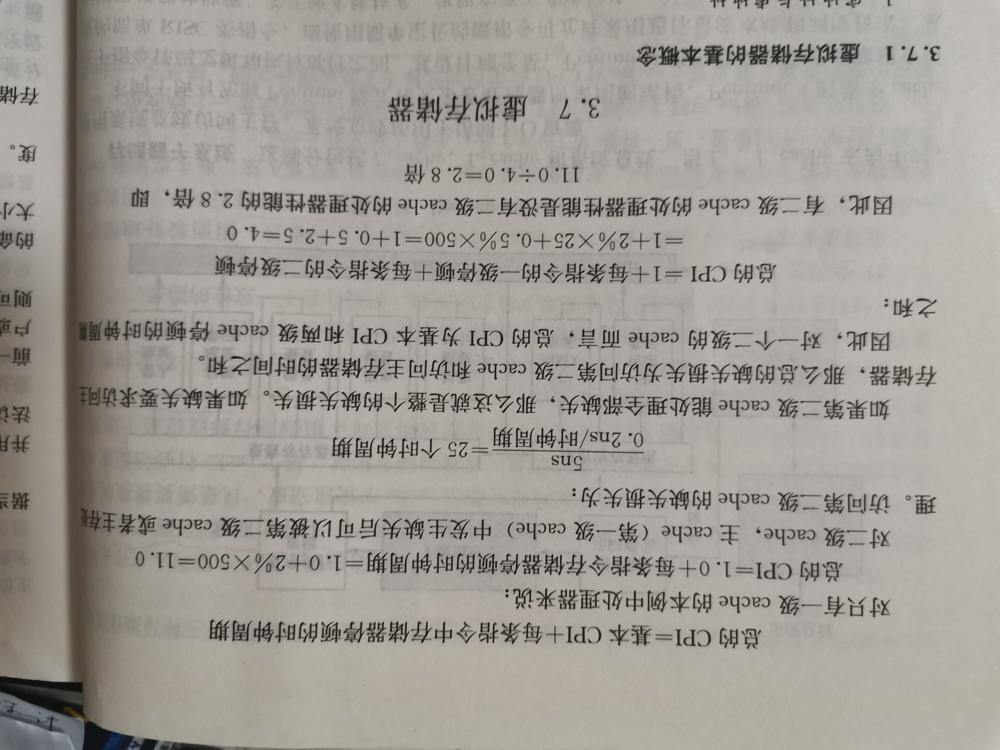

# Cache

## wikipedia [Cache (computing)](https://en.wikipedia.org/wiki/Cache_(computing))

## wikipedia [CPU cache](https://en.wikipedia.org/wiki/CPU_cache)

## zhihu [计算机缓存Cache以及Cache Line详解](https://zhuanlan.zhihu.com/p/37749443)

## Book-计算机组成原理-科学出版社

